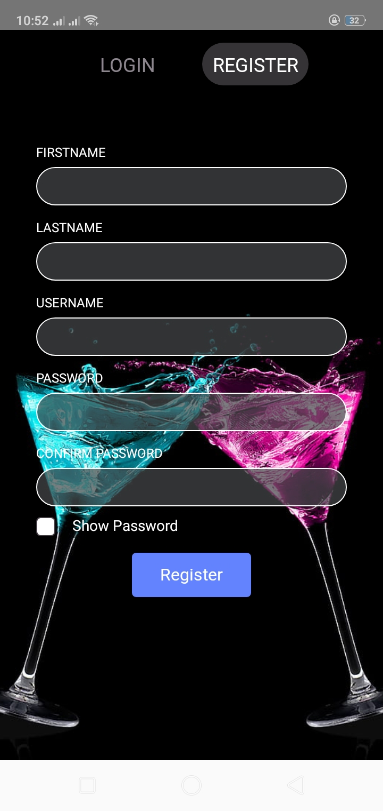
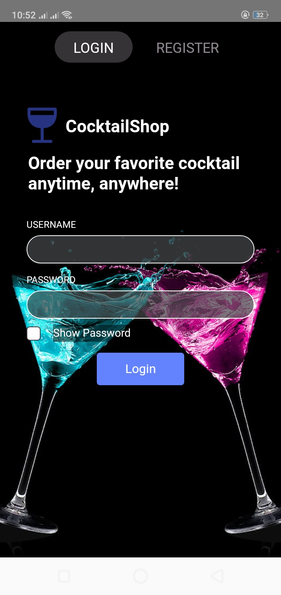
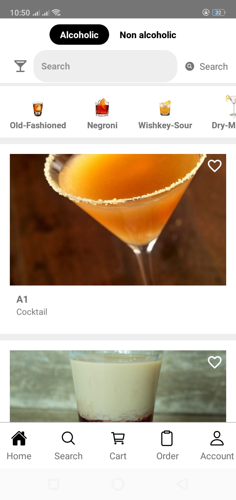
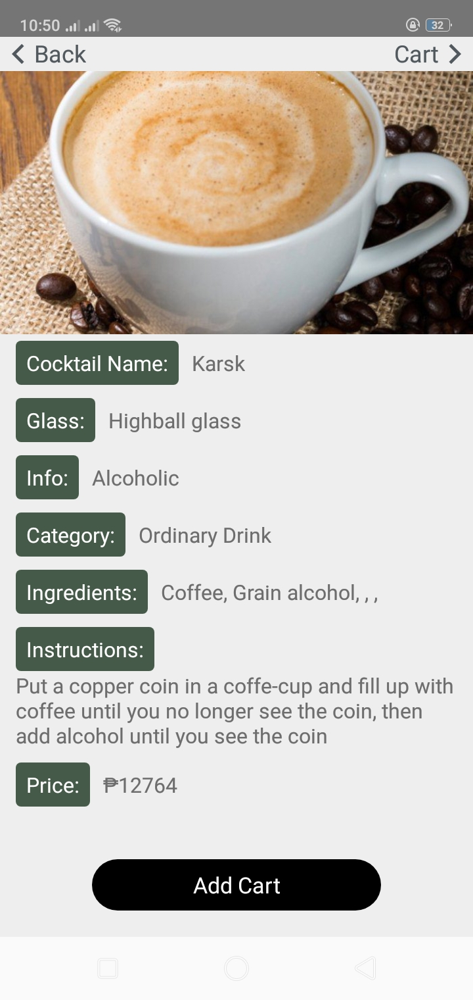
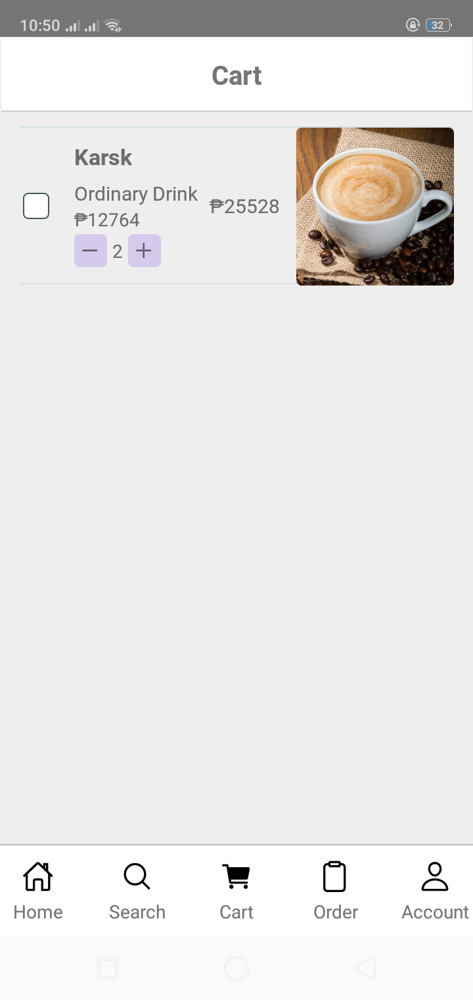
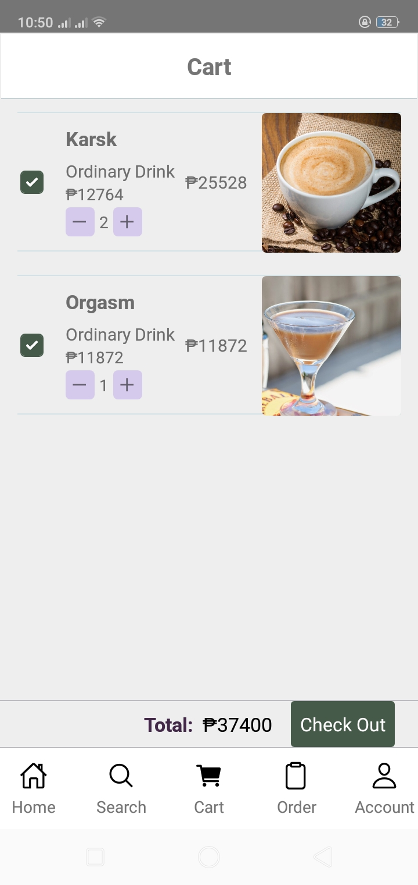
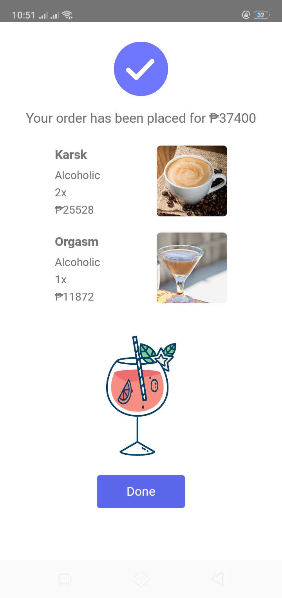
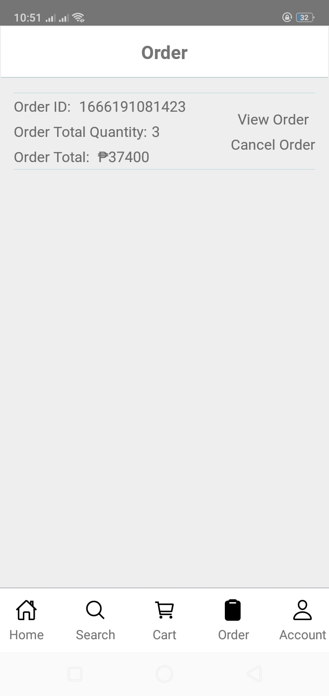
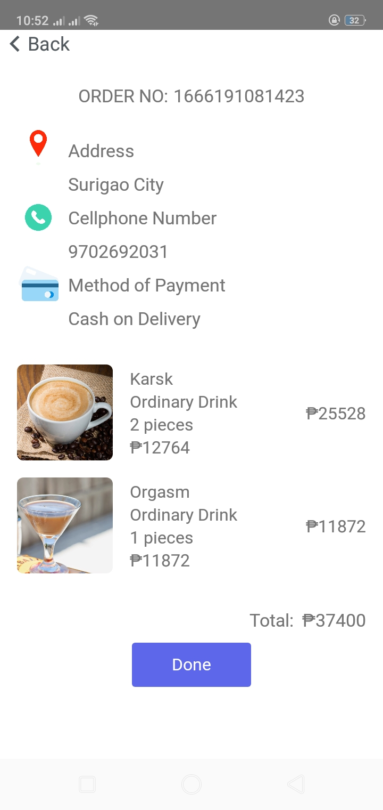
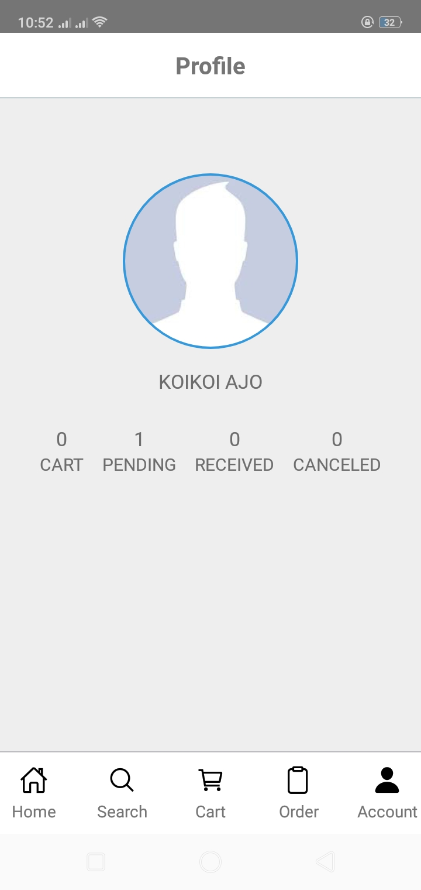

<h1 align="center"><a href='https://github.com/zuzimajo1/CocktailShop-Mobile-Application/releases/tag/%23apk' target='_blank' rel='noreferrer'>CocktailShop Mobile Application</a></h1>

<h2 align="center">ZappyFashion is an online shopping for fashion.</h2>

## ⚒️ Built with the following technologies:

<ul>
    <li>React-Native</li>
    <li>React Native Elements</li>
    <li>React Navigation</li>
    <li>Redux</li>
    
</ul>

## ✨ Features

<ul>
    <li>Can search cocktail in search tab</li>
    <li>Can add cocktail in the cart</li>
    <li>Can check only the desire cocktail in the cart for checkout</li>
    <li>Can view the order</li>
</ul>

## 🖼️ Preview

<h3 >Register</h3>
</img>
 
<h3 >Login</h3>
</img>
<h3 >Home</h3>
</img>
 
<h3 >Search</h3>
</img>
 
<h3 >Viewing single cocktail</h3>
</img>
 
<h3 >Cart</h3>
</img>
 
<h3 >Checking the cocktail to checkout</h3>
</img>
 
<h3 >Checkout</h3>
</img>
 
<h3 >When the order is done</h3>
</img>
 
<h3 >Orders</h3>
</img>
 
<h3 >Viewing the order</h3>
</img>
 
<h3 >Account</h3>
</img>
 
